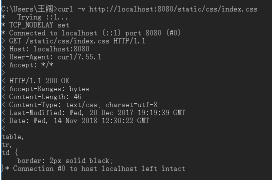

# cloudgo-io

cloudgo-io

---
## 概述

设计一个 web 小应用，展示静态文件服务、js 请求支持、模板输出、表单处理、Filter 中间件设计等方面的能力。（不需要数据库支持）

## 需求

1. 支持静态文件服务
2. 支持简单 js 访问
3. 提交表单，并输出一个表格
4. 对 `/unknown` 给出开发中的提示，返回码 `5xx`

## 实现

本次实验主要根据老师给出的框架，经过阅读理解与修改完成。本次实验添加了一个随机数的产生作为apitest的内容。

1. 静态文件服务

   将assets文件夹内的内容作为网站的static路由内容。
```
    // let add the Request with prefix "/static" be sent to FileServer
    mx.PathPrefix("/static").Handler(http.StripPrefix("/static/", http.FileServer(http.Dir(webRoot+"/assets/"))))
```

​	访问static可以显示网站根目录asset文件夹的静态文件：

​	

​	点击可以查看文件内容：


​	

​	使用curl 进行静态文件获取：




2. homepage主页内容

   

3. 简单js访问 :将js产生的内容显示到页面上

   

4. 登陆，然后产生一个表格(用户名和密码通过post的内容获取，随机数新生成一个)

   

   


5. 对 `/unknown` 给出开发中的提示，返回码 `5xx`  随便访问一个没有在代码里设置响应函数的路由时就返回还在开发中。
```
    //捕获其它所有没有绑定处理函数的url，统一返回开发中的提示
    mx.PathPrefix("/").HandlerFunc(inDevelopmentHandler)
```
  
